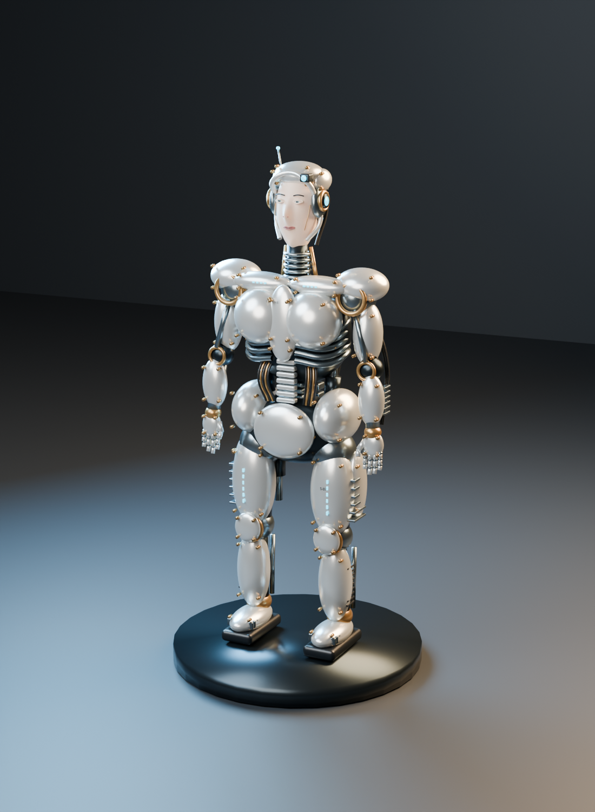
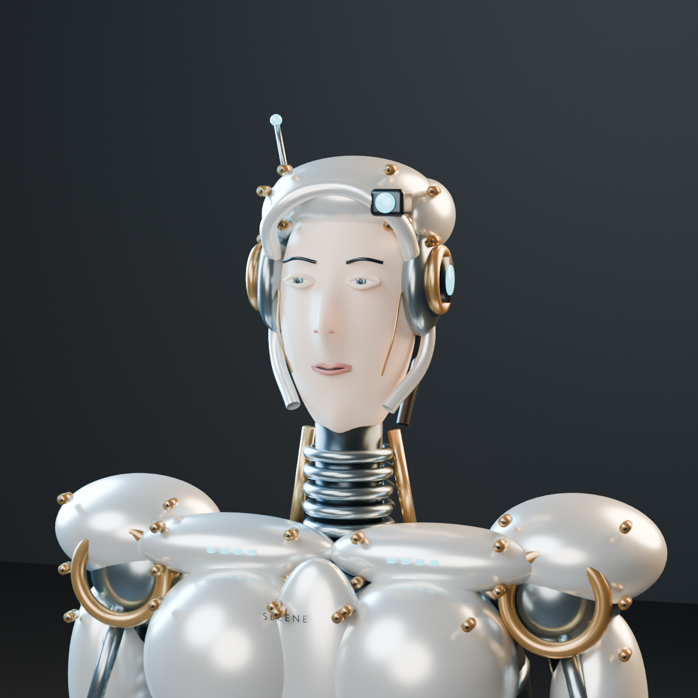
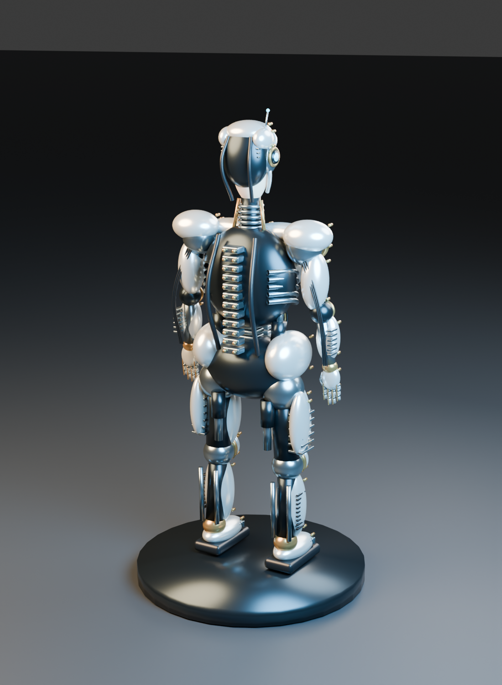

# SELENE — sci-fi female cyborg

Детализированный статичный арт женщины-киборга: светлое синтетическое лицо, открытый шлем с датчиками, жемчужный металлический корпус и видимая механика. В сцене 616 объектов и около 156 тысяч базовых вершин, до применения subdivision. Лицо стилизованное; модель не претендует на фотореалистичный ручной скульпт.

A procedural, detailed static Blender artwork: light synthetic human face, open helmet with optical sensors, pearl titanium armor, exposed actuators, articulated mechanical fingers, abdominal conduits and dorsal spine assemblies.

## Preview







## Files

- `SELENE.blend` — complete editable scene with materials, cameras and studio lighting.
- `create_robot.py` — deterministic scene generator and three-render pipeline.
- `renders/` — full-body, face detail and rear-mechanics PNG images.

## Rebuild

Created with Blender 5.2.2 LTS. No external assets or Python packages required.

```powershell
& 'C:\Program Files\Blender Foundation\Blender 5.2\blender.exe' --background --python create_robot.py
```

The script writes `SELENE.blend` and renders alongside itself. It clears the scene in the Blender process where it runs; use a separate background process as shown above.

The model is a static artwork assembled from editable meshes and curves. It has no animation rig, UV texture set or print preparation. Facial anatomy is procedurally shaped rather than hand-sculpted. Cycles renders use 64 samples with denoising.

Read-only scene verification:

```powershell
& 'C:\Program Files\Blender Foundation\Blender 5.2\blender.exe' --background SELENE.blend --python inspect_scene.py
```
